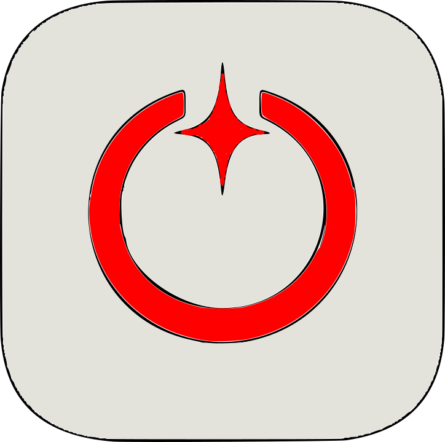

# Ignition (reference implementation)

**Ignition** is a local orchestration layer for a multi-module Spring Boot + Angular stack. It provides a single place to start and stop infrastructure (message broker, Elasticsearch, Kibana, Keycloak) and app modules from one CLI or web UI, with config generation driven by inventory.

- **CLI:** Implemented in **Python 3**; entry points: **Windows** `scripts/Ignition.ps1` (PowerShell launcher), **macOS/Linux** `scripts/ignition` (shell launcher). Commands: Status, Up, Down, Generate-Config.
- **UI:** Local web app served by a **Python (FastAPI)** server. Start with **Windows** `scripts/Start-IgnitionUI.ps1`, **macOS/Linux** `./scripts/start-ignition-ui.sh`, or `python -m ignition.server` — component list, Up All / Down All, Generate-Config. Optional desktop window: `pip install pywebview` then `python scripts/launch_ui_window.py`.
- **Inventory:** YAML or JSON at repo root defines components (Compose-based infra/monitoring and process-based Spring Boot/Angular modules).
- **Runtime:** Docker or Podman; Compose for infra; Ansible + Jinja (WSL on Windows, native on macOS/Linux) for generating `application.yml` and `environment.ts`.

This folder is the **reference implementation**. Copy or move its contents into your own Ignition repo when you create one.

---

## Prerequisites

**Required for Status, Up, Down, and the UI:**

- **Python 3** with **PyYAML** — CLI core. From repo root: `pip install -r requirements.txt` (or `pip3 install -r requirements.txt` on macOS/Linux). See [docs/setup-and-troubleshooting.md](docs/setup-and-troubleshooting.md).
- **Inventory** at repo root: copy `inventory.example.yaml` to `inventory.yaml` (or use `inventory.json`). See [docs/runbooks.md](docs/runbooks.md) §0.
- **Compose (for Up/Down of infra):** Docker or Podman with Compose; set `defaults.runtime` in inventory or `$env:DOCKER_OR_PODMAN`.
- **Windows launcher:** PowerShell 5.1+ to run `Ignition.ps1`.

**Only for Generate-Config** (optional — generates `application.yml` and `environment.ts` from inventory):

- **Ansible:** On Windows, WSL with Ansible installed (e.g. `sudo apt install ansible` in WSL). On macOS/Linux, Ansible on PATH (e.g. `pip install ansible` or system package). You can skip this if you don’t use Generate-Config.

---

## Quick start

1. **Repo root** = directory containing `inventory.yaml` (or .yml / .json), `compose/`, `scripts/`, and `ignition/` (Python package). Install CLI deps: `pip install -r requirements.txt` (from repo root).

2. **CLI — list components**
   - **Windows (PowerShell):** `.\scripts\Ignition.ps1 -Command Status`
   - **macOS/Linux:** `./scripts/Ignition status` (run `chmod +x scripts/Ignition` once if needed)

3. **CLI — start everything**
   - **Windows:** `.\scripts\Ignition.ps1 -Command Up`
   - **macOS/Linux:** `./scripts/Ignition up`
     (Starts Compose-based components first, then module processes. Requires Docker or Podman.)

4. **UI**
   - **Windows (PowerShell):** `.\scripts\Start-IgnitionUI.ps1 -RepoRoot C:\path\to\Ignition`
   - **macOS/Linux:** `./scripts/start-ignition-ui.sh` (or `./scripts/start-ignition-ui.sh --repo-root /path/to/artifacts --port 9080`)
   - **Any OS (Python):** From repo root: `python -m ignition.server --repo-root . --port 9080`
     Then open **http://localhost:9080/** (or the port you set). Optional desktop window: `pip install pywebview` then `python scripts/launch_ui_window.py`.

5. **Stop**
   - **Windows:** `.\scripts\Ignition.ps1 -Command Down`
   - **macOS/Linux:** `./scripts/Ignition down`
     Stops Compose stacks and module processes (via `.ignition/run/<id>.pid`).

---

## Documentation

| Doc                                                                                  | Description                                                                                                                      |
| ------------------------------------------------------------------------------------ | -------------------------------------------------------------------------------------------------------------------------------- |
| [docs/setup-and-troubleshooting.md](docs/setup-and-troubleshooting.md)               | **New machine / problems:** Full install checklist and troubleshooting (YAML, WSL, Ansible, UI). Updated when we fix new issues. |
| [docs/runbooks.md](docs/runbooks.md)                                                 | First-time setup, add module, switch broker (ActiveMQ/Kafka), use CLI and UI.                                                    |
| [ignition-repo-layout.md](ignition-repo-layout.md)                             | Target repo structure, scripts, inventory location, Compose and Ansible layout.                                                  |
| [inventory-schema.md](inventory-schema.md)                                           | Inventory schema (component types, fields).                                                                                      |
| [docs/test-checklist.md](docs/test-checklist.md)                                     | Smoke-test steps and expected outcomes for CLI and UI.                                                                           |
| [docs/smoke-test-result.md](docs/smoke-test-result.md)                               | Latest smoke-test results and fixes.                                                                                             |
| [config-generation.md](config-generation.md)                                         | How Ansible + Jinja generate config from inventory.                                                                              |
| [docs/elasticsearch-data-and-snapshots.md](docs/elasticsearch-data-and-snapshots.md) | Inject data into Elasticsearch: copy/paste snapshot folder, Ansible playbook to register repo and restore.                       |

---

## Commands (CLI)

| Command                  | Description                                                                               |
| ------------------------ | ----------------------------------------------------------------------------------------- |
| `Status`                 | List all components (Id, Name, Type, Enabled, Detail).                                    |
| `Up`                     | Start all enabled components (Compose then modules).                                      |
| `Up -ComponentId <id>`   | Start one component.                                                                      |
| `Down`                   | Stop all Compose stacks and module processes.                                             |
| `Down -ComponentId <id>` | Stop one component.                                                                       |
| `Generate-Config`        | Run Ansible to generate config into `generated/` (WSL on Windows, native on macOS/Linux). |

Optional: `-RepoRoot` (PowerShell) or `IGNITION_REPO` env var to point to the Ignition repo root.

---

## Testing

- **Automated UI smoke test (PowerShell):** From the artifacts folder run `.\scripts\smoke-test-ui.ps1`. This starts the Python UI server in the background, calls `GET /api/components`, `GET /api/status`, and `POST /api/command` (Status), then stops the server. Expect "UI smoke test: PASS" if all three succeed.
- **Manual tests:** See [docs/test-checklist.md](docs/test-checklist.md) for CLI steps (Status, Up/Down one component, Generate-Config) and UI steps (open http://localhost:9080/, click Status, Up All, etc.).
